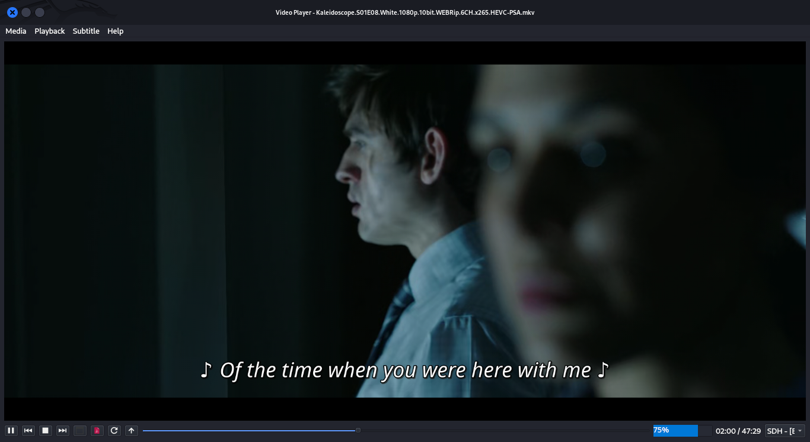

# Video Player App

This Python-based Video Player application allows users to playback media files with a comprehensive set of controls and features. It integrates with the VLC media player for robust media handling and provides an intuitive interface for managing playlists, subtitles, and playback options.

## Features

- **Media Playback:** Play, pause, stop, skip, and control volume.
- **Fullscreen Mode:** Toggle fullscreen for immersive viewing.
- **Playlist Management:** Create, edit, and manage playlists.
- **Subtitle Support:** Select and manage subtitles during playback.
- **Recent Media:** Quickly access recently played media files.
- **Toolbar and Menu Options:** Extensive toolbar and menu for easy navigation and control.
- **Visual Feedback:** UI elements provide clear feedback on media state and playback controls.
- **Keyboard Shortcuts:** Convenient keyboard shortcuts for common actions.
- **Preferences:** Customize player settings and preferences.

### Prerequisites

- Python 3.x
- PyQt5 library (`pip install PyQt5`)
- VLC media player (`pip install python-vlc`)

## Installation

1. Clone the repository:

    ```sh
    git clone https://github.com/Cypher-O/video_player.git
    cd video_player
    ```

2. Install dependencies:

    ```sh
    pip install -r requirements.txt
    ```

## Usage

To run the application, use the following command from the project directory:

    ```sh
    python main.py
    ```

## How to Use

1. **Playing Media:**
    - Open media files using the File menu or drag and drop onto the player.
    - Control playback using buttons for play, pause, stop, skip forward/backward.

2. **Fullscreen Mode:**
    - Toggle fullscreen mode using the fullscreen button or keyboard shortcut (F).

3. **Managing Playlists:**
    - Access and manage playlists using the Playlist button in the UI.
    - Add, remove, and reorder media files in the playlist.

4. **Subtitle Selection:**
    - Choose subtitles from available tracks using the Subtitle dropdown menu.
    - Customize subtitle settings and appearance as needed.

5. **Recent Media:**
    - Quickly access recently played media files from the Recent Media menu.

## Contributing

Contributions are welcome! Please read [CONTRIBUTING.md](CONTRIBUTING.md) for details on our code of conduct and the process for submitting pull requests.

## License

This project is licensed under the MIT License - see the [LICENSE](LICENSE) file for details.

## Screenshots

<table>
    <tr>
        <td>
            
            <p>Main Interface</p>
        </td>
        <td>
            
            <p>Fullscreen Mode</p>
        </td>
        <td>
            
            <p>Playlist View</p>
        </td>
    </tr>
</table>
